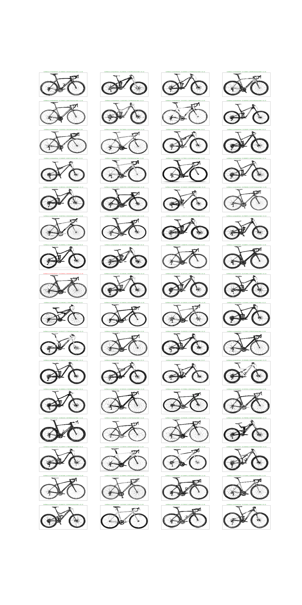

# tensorflow_bike_classification

* To run train.py use command **python train.py /path/to/dataset/directory** in the terminal
* To run test.py use command **python test.py /path/to/dataset/directory** in the terminal

This project aims at building a CNN to classify bike images into either road bike class or a mountain bike class.
The project consists of one train.py for training the CNN.

  * Load Images , label them and form dataset(train,test)
  * Build CNN model in tenforflow
  * Train CNN model for the train dataset and print train accuracy
  * Test CNN model on the test set

To run the train.py provide it with the data path of the directory containing the folders downloaded from 
[this link](https://drive.google.com/drive/folders/1ywyfiAEI0ql81gMy58UeamWvV7u9xGn9?usp=sharing) .
The image is *resized* to about im_size = (100,200) due to poor capacity of my system to work with larger 
nodes (required in processing large image files).The R,G,B images are converted to gray scale ones and *normalized*
to have pixel values between 0 and 255 before using then to train the CNN model.

Th CNN architecture:
 
 * conv2d layer --> relu activation --> max pool layer
 * conv2d layer --> relu activation --> max pool layer
 * fully connected layer --> relu activation
 * drop out layer with keep_prob = 0.8
 * fully connected layer (usually log softmax function is employed but not used in the defined architecture ,
   log softmax is explicitly applied when predicting classes in test.py )

The two conv2d layers convolve the input images with stride = 1 in each input dimension and filter_size = (3,3) .
The first conv2d maps 1 image channel to 32 feature channels while the second conv2d maps 32 image channels to 64
feature channels.After each convolution , the output of the convolution is passed through the rectified linear
unit(*relu*) activation functions followed by max pooling layers.The pooling layers are designed to reduce the input 
size by factor 2 in both the image dimensions.The kernel size and strides of the Max pool function 
(tf.nn.max_pool) can be changed to alter the max pool output dimension.
The output is flattened to be passed through a fully connected(fc) layer.The fc layer reduces inputs from 25x50x64 to
1024,relu activation followed.
To regularize the model a drop out layer is added right before the output layer (which is also a fc layer).The rate of 
passing the first fc layer node output is given by the keep_prob parameter of the drop out layer.The final fcn maps 1024
features to 2 features.The 2 feature value are the logits used in comparing the cost function in the training phase.

Following the modelling phase is the training phase.The training is done in batches to make better learning.The trainng loss is calculated for every batch and the optimization is done to reduce the mean training loss.This is done for required number of epochs.Finally The prediction scores (confidence) and prediction labels are caculated and the final training accuracy is displayed.

The model variables weights and biases of the trained model is saved in a .ckpt file.
In the test.py file the model variables saved are loaded and the prediction and confidence on the test images is calculated and displayed.An output image for test size of 0.3 is in this repository along with the tensorboard graph of the model built.

Changes in the model architecture, training batch size, epochs etcetera can be made to produce better results.

One of the classification results displaying confidence scores on the prediction and actual test label are shown below.
